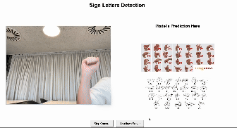

# Sign Language Detection

This repository contains the code and resources for a project developed during the *Industrial ML* course at Harbour.Space University in July 2024.

## Project Overview

The primary objective of this project is to detect sign language letters from a real-time camera feed. 

The approach involves extracting hand landmarks using the [Mediapipe](https://ai.google.dev/edge/mediapipe/solutions/vision/hand_landmarker) library and training a classifier based on these landmarks. [Mediapipe](https://ai.google.dev/edge/mediapipe/solutions/vision/hand_landmarker), developed by Google, is a robust library designed to extract human body landmarks. In this project, the hand detection module is used to obtain hand landmark locations.

Two open datasets were used to train the model:
- [American Sign Language Letters Dataset](https://public.roboflow.com/object-detection/american-sign-language-letters) from Roboflow.
- [ASL Alphabet](https://www.kaggle.com/datasets/grassknoted/asl-alphabet) from Kaggle.

After extracting the landmarks, a Random Forest classifier was built using these features. Experimentation and model optimization were done using MLflow. Once the optimal model was found, a user interface was developed using Flask API, and Docker was utilized for deployment.

## Setup the Project

- Create a directory for the project and cd into it
- Clone the project into this directory - use depth to avoid download large train data - (`git clone --depth 1 https://github.com/kadiogluberke/iml_24_project.git  .`)
- Open app folder with `cd app`
- Open Docker Desktop, if you not have it you can download from [here](https://www.docker.com/products/docker-desktop/)
- Run `docker-compose build` to build docker image 
- Run `docker-compose up` to run docker container 
- Go `http://localhost:5001` to reach the interface 

- Demo:

## Project Structure

- [app/](app/): Contains files and directories for the user interface and Docker configuration.
  - [api/](app/api/): Includes files for the Flask API implementation.
  - [models/](app/models/): Stores the trained model used in the application.
- [eda/](eda/): Contains Jupyter notebooks for exploratory data analysis.
- [experiments/](experiments/): Includes notebooks for experimentation using MLflow.
- [real_time/](real_time/): Contains the notebook for real-time predictions.

## Instructors

- [Emeli Dral](https://www.linkedin.com/in/emelidral/)
